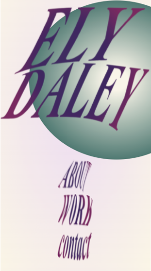
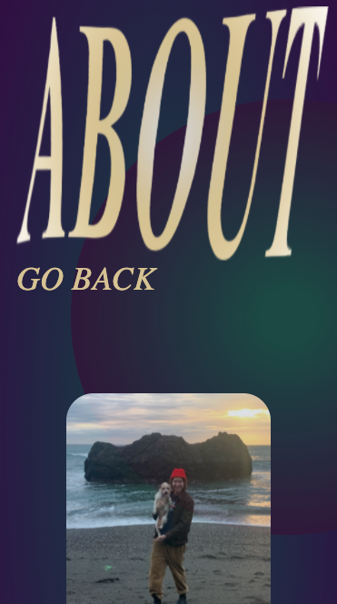
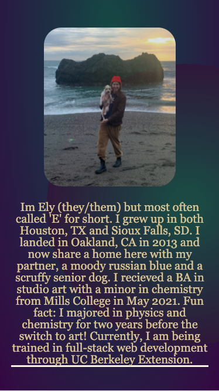
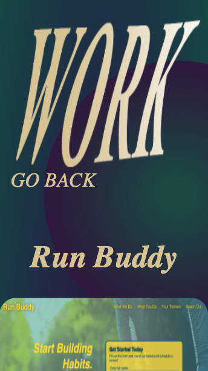
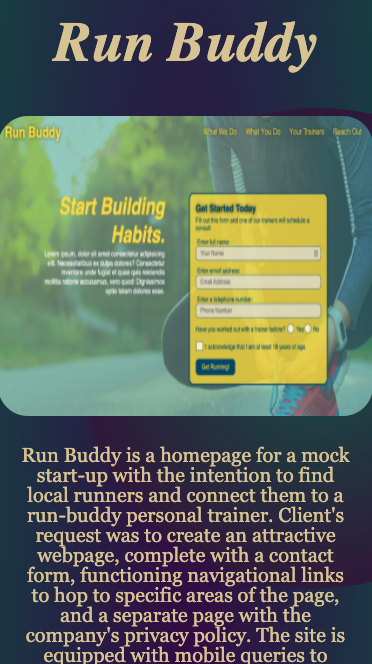
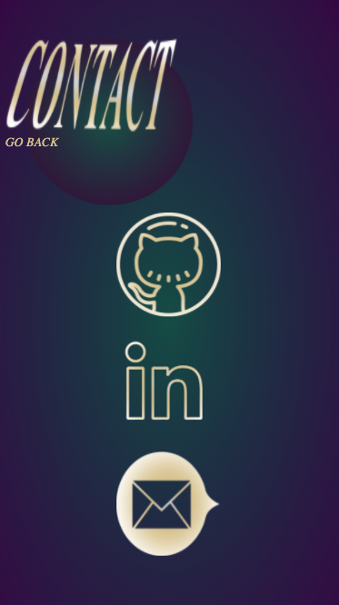

# Daley-Portfolio
Ely daley website
# Horiseon Accessibility Project

> Live demo [_here_](https://3lydaley.github.io/Daley-Portfolio/). <!-- Project link here. -->

## Table of Contents
* [General Info](#general-information)
* [Technologies Used](#technologies-used)
* [Features](#features)
* [Screenshots](#screenshots)
* [Project Status](#project-status)
* [Room for Improvement](#room-for-improvement)
* [Contact](#contact)
<!-- * [License](#license) -->

## General Information
My (Ely's) portfolio's first working draft. The goal was to create something individually stylized, and to try and push my understanding of CSS 
through pseudoclasses and mobile-friendly amendments. The portfolio ultimately exists to showcase previous work and individual expression in the 
aesthetic of the portfolio itself. I intended to have the main stage, so to speak, be the graphic design, functionality, and accessibility of the portfolio itself, extended
by the previous, current, and future projects that will be added in the future. There is a contact page including links to my Github, LinkdIn, and email, and an about me page 
with an introductory paragraph & photo for further personalization.

## Technologies Used
- Tech 1 - VS Code
- Tech 2 - HTML5
- Tech 3 - CSS

## Features
List the ready features here:
- Separate pages for simplicity/ variation in color scheme
- Mobile-friendly by way of viewport manipulations 
- Accessible images and detailed comments for an easy-to-navigate code

## Screenshots
- Mobile layout 

>

## Project Status
Project is: _in progress_ 

## Room for Improvement

Room for improvement:
- Improving the layout of the "work" page, possibly full re-design to improve mobile functionality.
- The site could use some more user interactivity, my ideas 
are to animate the scrolling text on the about me page, possibly giving each project its own page and making the workpage a list to increase negative space and further allow
for mobile finessing. 
- Possible reformatting, starting from a 575px viewport and working up from there.

## Contact
Created by [@3lydaley](https://github.com/3lyDaley) - feel free to contact me!

<!-- Optional -->
<!-- ## License -->
<!-- This project is open source and available under the [... License](). -->

<!-- You don't have to include all sections - just the one's relevant to your project -->